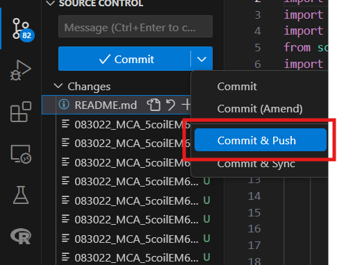

# Sensor Data Analysis Tool

This Python script processes and analyzes sensor data from multiple sensors, identifying peaks, visualizing the data, and exporting results. It supports multiple file inputs in a single run, allowing users to select and process additional files without restarting the program.

## Features

- Load sensor data from text files.
- Clean and process data, handling missing values.
- Group data by different sensor groups.
- Identify peaks in sensor readings for each group.
- Plot sensor data and identified peaks.
- Export data for individual sensors.
- Supports handling multiple files in one session.

## Prerequisites

Before running the script, ensure you have the following Python packages installed:

- `numpy`
- `pandas`
- `matplotlib`
- `scipy`
- `pyproj`
- `PyQt5`

You can install them using pip:

```bash
pip install numpy pandas matplotlib scipy pyproj PyQt5
```

If that one does not work, use:

```python
py -m pip install numpy pandas matplotlib scipy pyproj PyQt5
```

In order to install all the requirements, use:

```python
py -m pip install -r requirements.txt
```

## How to Use

1. Clone the repository to your local machine:

   ```bash
   git clone https://github.com/andresedg/QCDataProcessing
   ```
2. Navigate to the project folder:

   ```bash
   cd your-repo
   ```
3. Run the script:

   ```bash
   python main.py
   ```

   Or press the run button (right upper corner)
4. When file explorer window appear, select a file of the EM61 5 Coil System data file (.xyz) with all the sensors. Ensure that the file follows the required format.
5. Optional user interactions:

   - To display the header of the data, type `Y` when prompted.
   - To show the sensor-group table type `Y` when prompted
   - To plot the sensor data, type `Y` when prompted.
   - To export the group-sensor table as a .xlsx file type `Y`:
     - Select folder where you want to save the file, when file explorer window appears
     - Enter the name of the file (date is included from the data automatically)
     - Enter name of the sheet where the table is going to be on your excel file
   - You can select which sensor data to analyze by choosing from: `L1`, `L2`, `C`, `R1`, or `R2`.
     - To plot sensor data type `Y`
     - To export the data type `Y`, select a folder and enter the name for the file that is been exported
     - Select another sensor from the file or type `exit` to continue
6. After processing a file, the program will ask if you want to select another file. Select a new file or type exit to end the session.

## Data Analysis

The script processes data from the following sensor groups:

- **L1**: Left sensor
- **L2**: Left sensor 2
- **C**: Center sensor
- **R1**: Right sensor 1
- **R2**: Right sensor 2

After loading and processing, the script detects peaks in the `CH_1` sensor reading for each group and displays the results in tabular and graphical formats.

## Plotting

When plotting is enabled, the script will generate a plot showing the sensor readings for the first 800 data points (Test peak is made in the first records of the file) and mark the peaks.

## Example Data File

The file format should follow this column structure:

```
L1_coil_X, L1_coil_Y, L2_coil_X, L2_coil_Y, C_coil_X, C_coil_Y, ...
```

The EM61 5 Coil System with all the sensors should have 52 columns and is not relevant if the header includes a `/` or not.

Ensure that the `DATE` and `TIME` columns exist and are in the format `MM/DD/YY HH:MM:SS.FFF`.

## Multiple File Processing

After processing one file, the script will prompt you to enter another file or exit. This allows users to efficiently handle multiple data files in a single session.

## Pushing changes from local repository

If you want to modify the code and update the repository. You can follow this steps in order to update all your changes.

##### VS Code Activity bar

* Every time that you modify a file (yellow - M) or create a file (green - U) you are going to be able to see them in the activity bar > Source control section:

<pre class="vditor-reset" placeholder="" contenteditable="true" spellcheck="false"><p data-block="0"></p><p data-block="0"></p></pre>

* To commit and push the changes press `commit & push` from the dropdwon list

  
* Modify the commit file to add some comments about the changes on the files and save
* After that you can check on the repository if the changes are there

##### Command Promp

Stage the changes:

```bash
git add .
```

```bash
git commit -m "Description of your changes"
```

```bash
git push origin main
```

After you push your changes, anyone who has access to the repository can run the following to get your updates:

```bash
git pull
```
